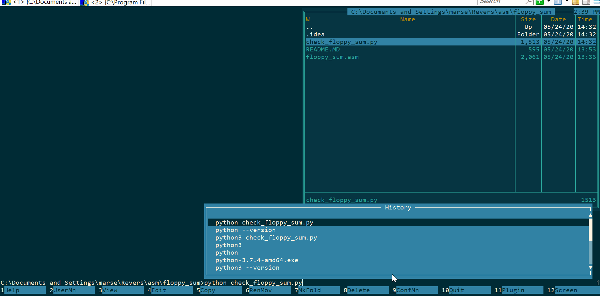

# Motivation

Assembler long arithmetic, read/write floppy interrupts

# Prerequisites
1. emu8086
2. python 3.6

# Description
1. Run ```python3.6 check_floppy_sum.py```. It will write two 512 bytes blocks into ```C:\Program Files (x86)\emu8086\FLOPPY_0```
and pause
2. Run ```floppy_sum.asm``` in emu8086. It will read first 512 bytes as var_1 and second 512 bytes
as var_2 from _FLOPPY_0_. Then it will add var_1 and var_2 and 
write result into next 1024 bytes of _FLOPPY_0_.
3. Press enter in ```check_floppy_sum.py```. 1024 bytes result will be read and compared with _var_1+var_2_

# Demo
